# Riskient - Portfolio Risk Analytics Platform

A real-time portfolio risk analytics platform built with a microservices architecture. Users create investment portfolios, and the system continuously fetches live market data, computes risk metrics, and displays everything on an interactive dashboard with real-time updates.

This platform simulates a simplified version of the risk dashboards used by portfolio managers at firms like Fidelity, BlackRock, and Goldman Sachs.

---

## Screenshots

### Authentication
| Sign In | Sign Up |
|---------|---------|
| 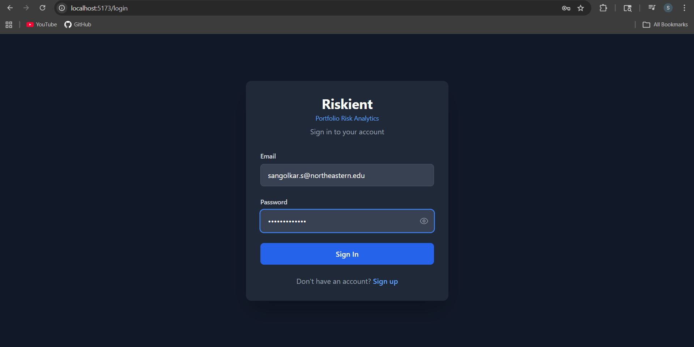 | 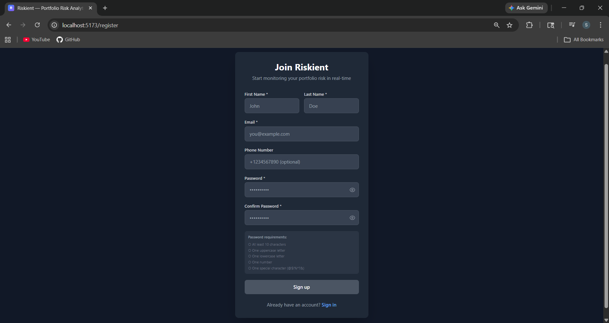 |

### OTP Verification
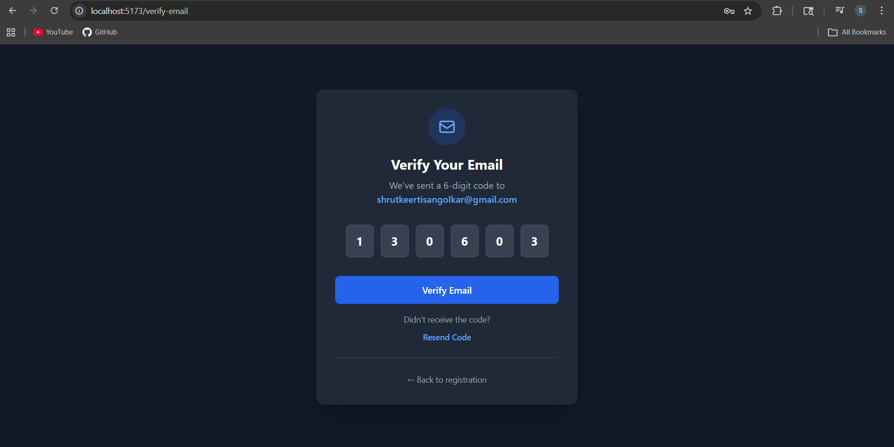

### Dashboard Overview
Live data with real-time price updates every 30 seconds.

| Market Open | Market Closed |
|-----------------------|-------------------------|
| 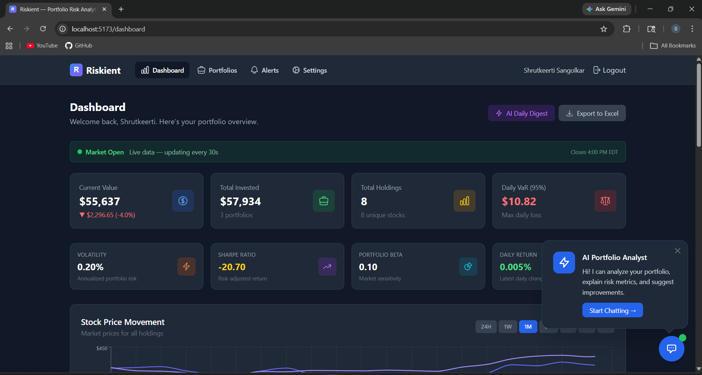 | 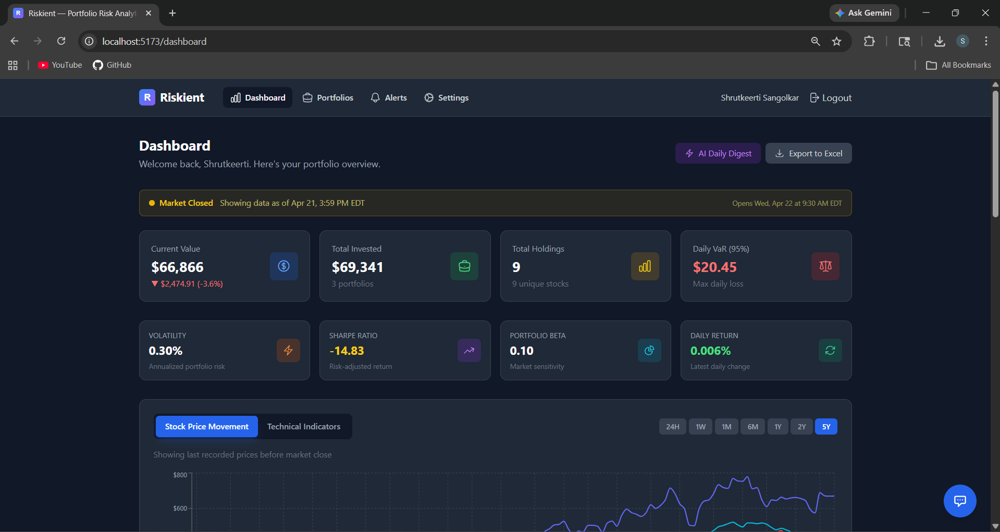 |

| Line Graph | Technical Indicators | AI Analysis | Dashboard Holdings |
|-------------------|-----------------|-------------------|-----------------|
| 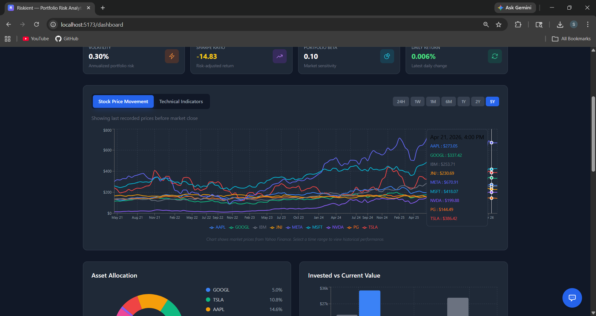 | 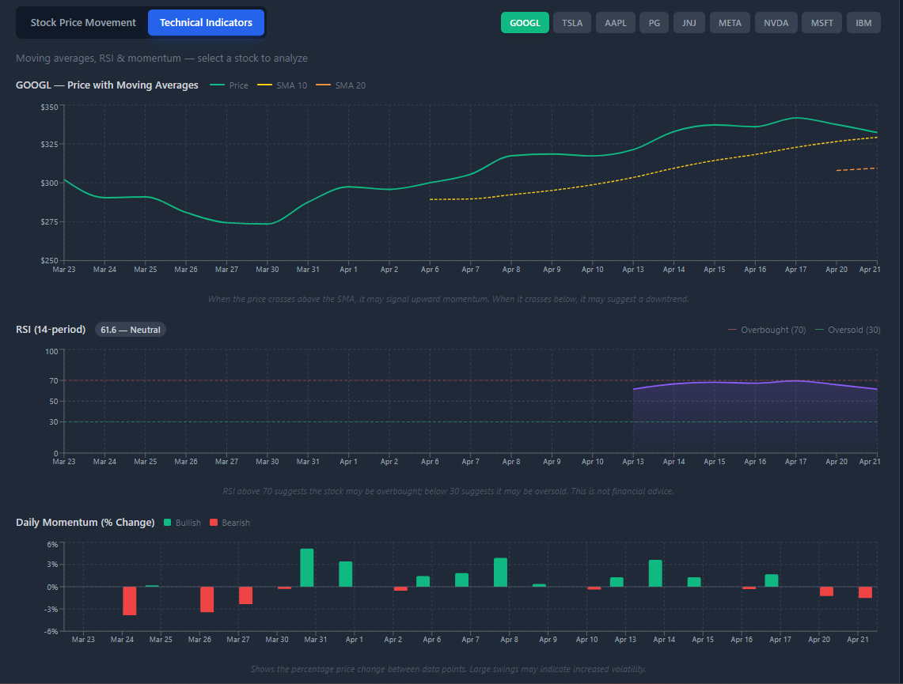 | 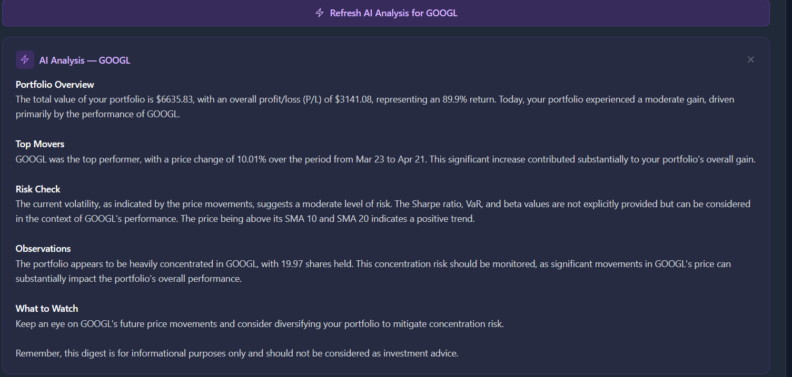 | 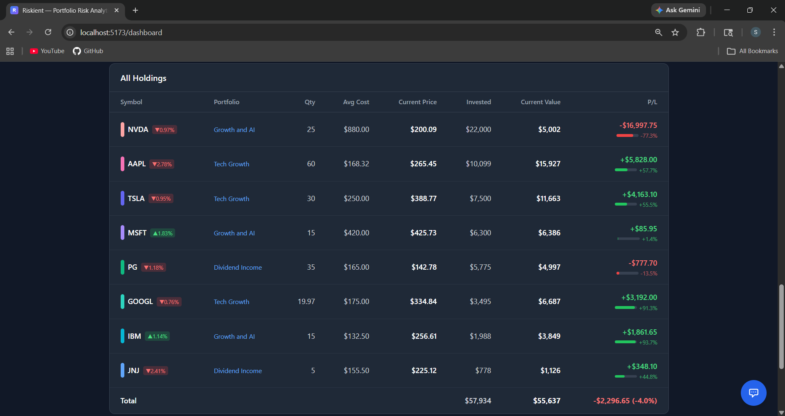 |

### AI Daily Digest
One-click AI-generated portfolio briefing covering performance, top movers, risk check, and observations.

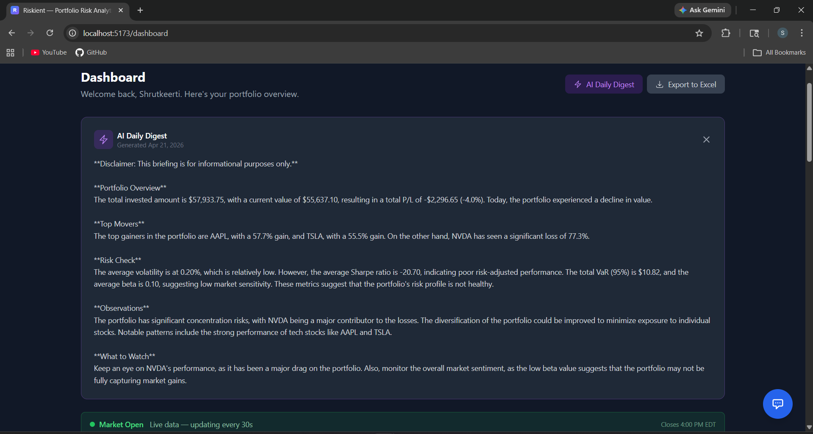

### Portfolio Management
| All Portfolios | Create New Portfolio |
|---------------|---------------------|
| 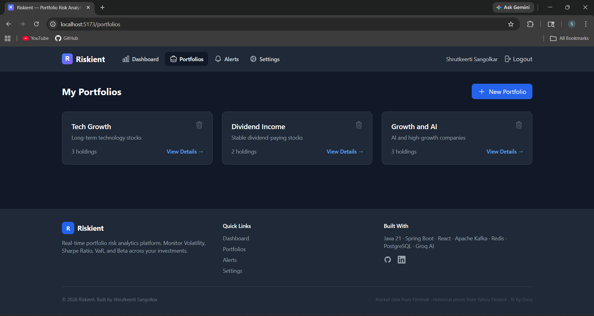 | 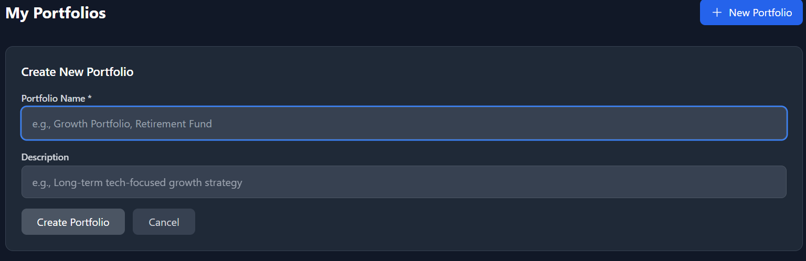 |

### Portfolio Detail
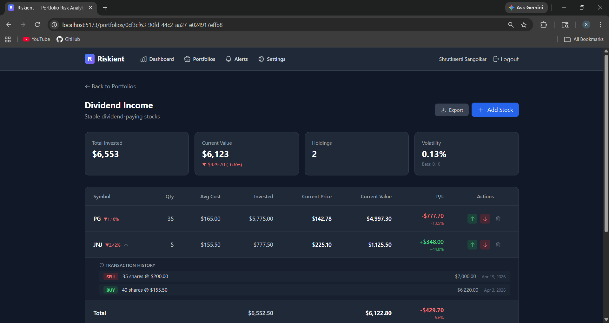

### Holdings — Add, Buy & Sell
| Add Stock + AI Research | Buy More | Sell Shares |
|------------------------|----------|-------------|
| 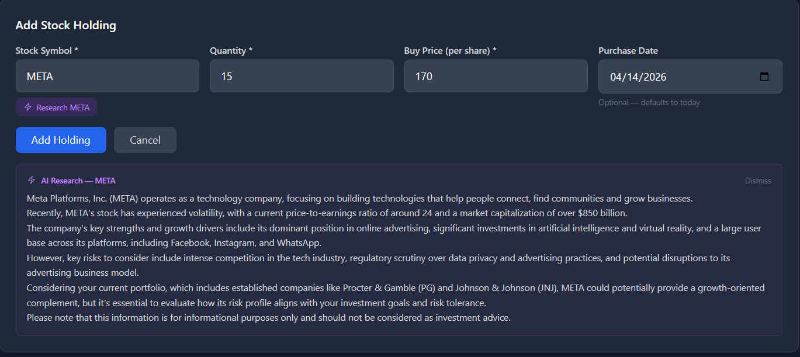 | 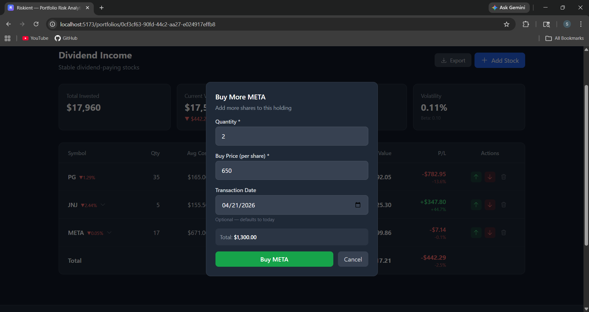 | 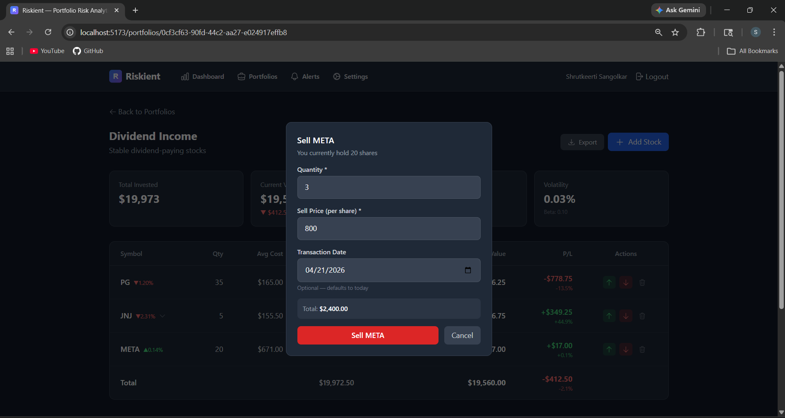 |

### AI Stock Research
Research any stock with AI before adding it to your portfolio — get company overview, key metrics, risks, and portfolio fit analysis.


### Alert Rules & Settings
| Alert Rules | Settings |
|-------------|----------|
| 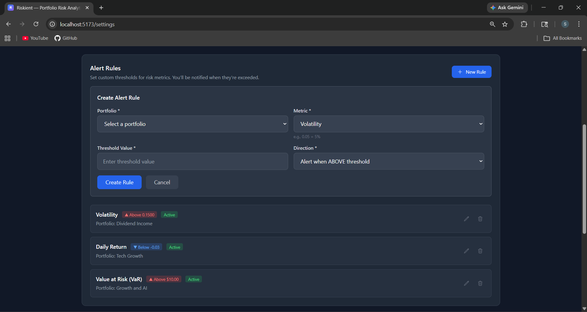 | 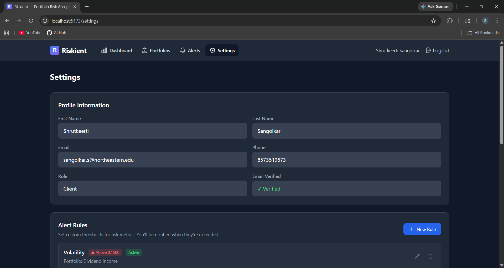 |

### Notifications & AI Alert Summaries
Grouped alerts with AI-powered plain-English explanations of what happened, why it matters, and what to watch.

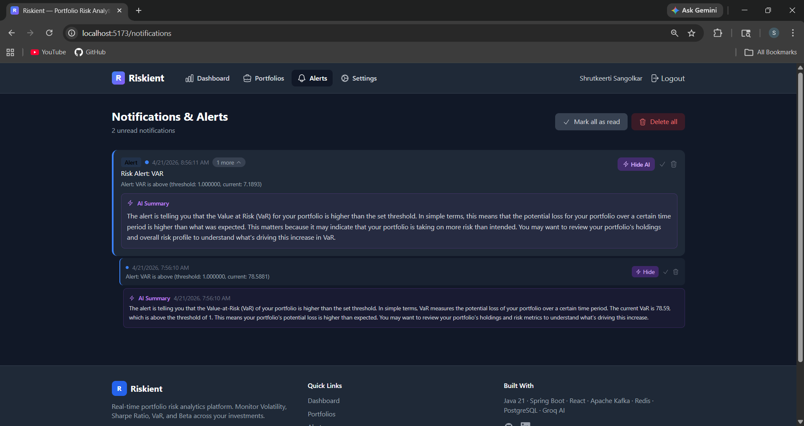

### AI Portfolio Analyst
Natural language portfolio analysis powered by Groq/Llama AI with suggested questions for diversification, risk, rebalancing, and more.

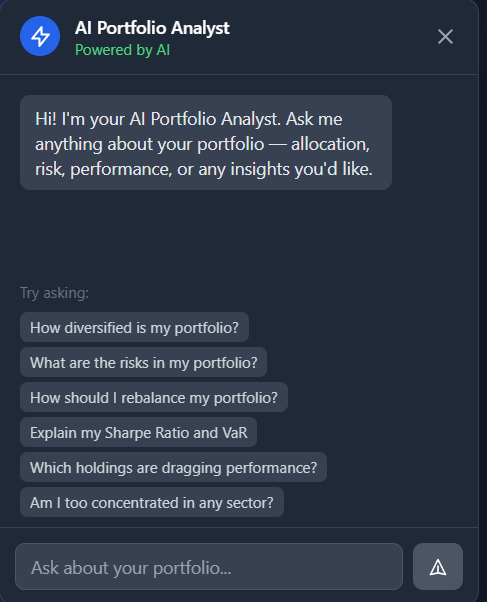

---

## Features

- **User Authentication** — JWT-based auth with email OTP verification, password strength validation, and email alias normalization
- **Portfolio Management** — Create portfolios, add/remove stock holdings, buy more/sell shares with weighted average cost recalculation
- **Transaction History** — Full buy/sell transaction log per holding with date, quantity, price, and total amount tracking
- **Real-Time Market Data** — Live stock prices streamed via Kafka from the Finnhub API, updated every 30 seconds
- **Historical Price Charts** — Interactive stock price charts powered by Yahoo Finance with selectable time ranges (24H, 1W, 1M, 6M, 1Y, 2Y, 5Y)
- **Risk Analytics** — Automated calculation of Volatility, Sharpe Ratio, Value at Risk (VaR), and Portfolio Beta
- **Market Hours Detection** — Automatically detects market open/close (Mon–Fri 9:30 AM–4:00 PM ET), preserves last meaningful risk snapshot after hours
- **Market Status Banner** — Real-time market open/closed indicator with next open/close time and pulsing live data indicator
- **Interactive Dashboard** — Summary cards with icons, asset allocation pie chart, invested vs current value comparison, and multi-stock price movement chart
- **Custom Alert Rules** — User-configurable thresholds for volatility, VaR, Sharpe ratio, beta, and daily return with 1-hour cooldown to prevent spam
- **Grouped Notifications** — Duplicate alerts are collapsed with expand/collapse, bulk mark-as-read, and delete-all functionality
- **AI Portfolio Analyst** — Natural language portfolio analysis powered by Groq/Llama AI — ask questions about allocation, risk, and diversification
- **Excel Export** — Export all portfolios, holdings, transactions, and risk metrics to Excel from the dashboard or per-portfolio
- **Role-Based Access** — Clients see their own portfolios; Advisors can manage multiple client portfolios
- **Responsive Design** — Mobile-friendly with hamburger menu and horizontal scrolling tables
- **CI/CD Pipeline** — Automated build verification via GitHub Actions on every push

---

## Architecture Overview

The platform follows an event-driven microservices architecture with three independently deployable services communicating through Kafka (real-time price streaming) and RabbitMQ (task-based alert messaging), with Redis as a caching layer for low-latency dashboard reads.

```
[Finnhub API] → [Risk Engine] → [Kafka] → [Risk Calculator] → [Redis + PostgreSQL]
                                                  ↓
[Yahoo Finance] → [Historical Prices]       [RabbitMQ] → [Notification Service]
                                                  ↓
[React Dashboard] ← REST APIs ← [Portfolio Service] ← [Redis Cache]
```

---

## Tech Stack

| Layer        | Technology                                                        |
|--------------|-------------------------------------------------------------------|
| Backend      | Java 21, Spring Boot 3.5, Spring Security, Spring Data JPA        |
| Streaming    | Apache Kafka (real-time price feeds)                              |
| Messaging    | RabbitMQ (alerts & task queues)                                   |
| Caching      | Redis (current prices & risk metrics)                             |
| Database     | PostgreSQL 15                                                     |
| Frontend     | React 18, Vite, Recharts, Tailwind CSS, Axios                     |
| AI           | Groq API (Llama 3.3 70B) for portfolio analysis                   |
| Containers   | Docker + Docker Compose                                           |
| CI/CD        | GitHub Actions                                                    |
| API Docs     | Springdoc OpenAPI (Swagger UI)                                    |
| Testing      | JUnit 5, Mockito                                                  |
| External API | Finnhub (real-time stock data), Yahoo Finance (historical prices) |

---

## Microservices

| Service                  | Port | Responsibility                                                                 |
|--------------------------|------|--------------------------------------------------------------------------------|
| **Portfolio Service**    | 8081 | User auth (JWT+OTP), portfolio CRUD, holdings management, WebSocket broadcaster|
| **Risk Engine Service**  | 8082 | Price fetching (Finnhub), Kafka streaming, risk calculations, alert evaluation |
| **Notification Service** | 8083 | RabbitMQ consumer, alert processing, notification storage & delivery           |

---

## API Endpoints

### Portfolio Service (Port 8081)

#### Authentication

| Method | Endpoint                 | Description                     | Auth |
|--------|--------------------------|---------------------------------|------|
| POST   | `/api/auth/register`     | Register new user (sends OTP)   | No   |
| POST   | `/api/auth/login`        | Login (requires verified email) | No   |
| POST   | `/api/auth/verify-email` | Verify email with OTP code      | No   |
| POST   | `/api/auth/resend-otp`   | Resend OTP to email             | No   |
| GET    | `/api/auth/me`           | Get current user profile        | Yes  |

### Portfolios & Holdings (Port 8081)

| Method | Endpoint                                            | Description                        | Auth |
|--------|-----------------------------------------------------|------------------------------------|------|
| GET    | `/api/portfolios`                                   | Get all portfolios                 | Yes  |
| POST   | `/api/portfolios`                                   | Create portfolio                   | Yes  |
| GET    | `/api/portfolios/{id}`                              | Get portfolio detail               | Yes  |
| PUT    | `/api/portfolios/{id}`                              | Update portfolio                   | Yes  |
| DELETE | `/api/portfolios/{id}`                              | Delete portfolio                   | Yes  |
| GET    | `/api/portfolios/{id}/holdings`                     | Get holdings                       | Yes  |
| POST   | `/api/portfolios/{id}/holdings`                     | Add holding (with purchase date)   | Yes  |
| PUT    | `/api/portfolios/holdings/{holdingId}`              | Update holding                     | Yes  |
| DELETE | `/api/portfolios/holdings/{holdingId}`              | Remove holding                     | Yes  |
| POST   | `/api/portfolios/holdings/{holdingId}/transactions` | Buy more or sell shares            | Yes  |
| GET    | `/api/portfolios/holdings/{holdingId}/transactions` | Get holding transaction history    | Yes  |
| GET    | `/api/portfolios/{id}/transactions`                 | Get all portfolio transactions     | Yes  |

### AI Chat (Port 8081)

| Method | Endpoint        | Description                    | Auth |
|--------|-----------------|--------------------------------|------|
| POST   | `/api/ai/chat`  | AI portfolio analysis chat     | Yes  |

### Risk Engine (Port 8082)

| Method | Endpoint                                    | Description                            |
|--------|---------------------------------------------|----------------------------------------|
| GET    | `/api/risk/portfolio/{portfolioId}`         | Get latest risk metrics                |
| GET    | `/api/risk/portfolio/{portfolioId}/history` | Get historical risk snapshots          |
| POST   | `/api/risk/calculate/{portfolioId}`         | Trigger risk recalculation             |
| GET    | `/api/risk/market-status`                   | Get market open/close status           |
| GET    | `/api/risk/prices/{symbol}`                 | Get latest stock price                 |
| GET    | `/api/risk/prices?symbols=AAPL,GOOGL`       | Get prices for multiple stocks         |
| GET    | `/api/risk/prices/{symbol}/history`         | Get stock price history (DB)           |
| GET    | `/api/risk/prices/{symbol}/candles`         | Get historical candles (Yahoo Finance) |
| GET    | `/api/risk/health`                          | Service health check                   |

### Notifications & Alerts (Port 8083)

| Method | Endpoint                                   | Description                    |
|--------|--------------------------------------------|--------------------------------|
| GET    | `/api/notifications/{userId}`              | Get all notifications          |
| GET    | `/api/notifications/{userId}/unread/count` | Get unread count               |
| PUT    | `/api/notifications/{notificationId}/read` | Mark as read                   |
| PUT    | `/api/notifications/{userId}/read-all`     | Mark all as read               |
| DELETE | `/api/notifications/{notificationId}`      | Delete notification            |
| GET    | `/api/alert/rules/{userId}`                | Get user's alert rules         |
| POST   | `/api/alerts/rules`                        | Create alert rule              |
| PUT    | `/api/alerts/rules/{ruleId}`               | Update alert rule              |
| DELETE | `/api/alerts/rules/{ruleId}`               | Delete alert rule              |
---

## Security Features

- **JWT Authentication** — Stateless token-based auth with configurable expiration
- **Email OTP Verification** — 6-digit code sent via Gmail SMTP during registration
- **Password Policy** — Minimum 10 characters with uppercase, lowercase, number, and special character
- **Email Alias Normalization** — Prevents duplicate accounts via Gmail dot tricks and + aliases
- **OTP Rate Limiting** — Maximum 5 OTP requests per 15 minutes per email
- **OTP Attempt Limiting** — Maximum 3 incorrect attempts per OTP code
- **Environment Variables** — All secrets stored in `.env` (gitignored), never hardcoded

---

## Risk Metrics

| Metric              | Description                                   | Formula                                              |
|---------------------|-----------------------------------------------|------------------------------------------------------|
| Volatility          | How much portfolio returns fluctuate          | Std Dev of daily returns × √252                      |
| Sharpe Ratio        | Risk-adjusted return measure                  | (Return - Risk-Free Rate) / Volatility               |
| Value at Risk (VaR) | Maximum expected daily loss at 95% confidence | Portfolio Value × (Mean Return - 1.645 × Volatility) |
| Portfolio Beta      | Sensitivity to market movements               | Weighted average of individual stock betas           |

---

## Data Flow

1. **Price Fetching** — Scheduled task calls Finnhub API every 30 seconds for each stock in user portfolios
2. **Kafka Streaming** — Live prices are published to `stock-price-updates` Kafka topic
3. **Risk Calculation** — Kafka consumer triggers risk recalculation for affected portfolios
4. **Storage** — Risk snapshots saved to PostgreSQL, current prices cached in Redis
5. **Market Hours Check** — After market close (4:00 PM ET), risk engine preserves last meaningful snapshot instead of overwriting with zeros
6. **Historical Prices** — Yahoo Finance provides historical candle data (24H to 5Y) for the interactive chart, independent of when the service was running
7. **Alert Evaluation** — Notification Service evaluates user-defined alert rules against current metrics with 1-hour cooldown to prevent duplicate alerts
8. **Alert Delivery** — Triggered alerts sent via RabbitMQ, stored as notifications, and grouped on the frontend
9. **Dashboard** — Frontend fetches data every 30 seconds, displays live charts, P/L, market status, and supports Excel export
10. **Transaction Tracking** — Buy/sell transactions are recorded with dates and prices, holdings auto-update with weighted average cost basis

---

## Project Status

-  [x] Project setup & Docker Compose (PostgreSQL, Redis, Kafka, Zookeeper, RabbitMQ)
- [x] Portfolio Service — JWT Authentication with email OTP verification
- [x] Portfolio Service — Portfolio, Holdings & Transaction CRUD APIs
- [x] Portfolio Service — Buy more / sell shares with weighted avg cost recalculation
- [x] Portfolio Service — Transaction history per holding with purchase dates
- [x] Risk Engine — Finnhub API integration (real-time stock prices)
- [x] Risk Engine — Apache Kafka producer/consumer (price streaming)
- [x] Risk Engine — Risk calculation engine (Volatility, Sharpe, VaR, Beta)
- [x] Risk Engine — Stock price history API
- [x] Risk Engine — Market hours detection with risk metric persistence
- [x] Risk Engine — Market status API endpoint
- [x] Risk Engine — Yahoo Finance integration for historical price charts
- [x] Notification Service — RabbitMQ alert pipeline
- [x] Notification Service — Custom alert rules with configurable thresholds
- [x] Notification Service — 1-hour alert cooldown to prevent notification spam
- [x] React Frontend — Auth pages (Login, Register, Email Verification)
- [x] React Frontend — Dashboard with charts, risk metrics, and live P/L
- [x] React Frontend — Market open/closed status banner with live indicator
- [x] React Frontend — Interactive price chart with timeline selector (24H to 5Y)
- [x] React Frontend — Portfolio detail with buy/sell transactions and history
- [x] React Frontend — Excel export (dashboard-wide and per-portfolio)
- [x] React Frontend — Grouped notifications with expand/collapse and delete all
- [x] React Frontend — Risk metric cards with icons
- [x] React Frontend — Portfolio management with real-time stock prices
- [x] React Frontend — Notifications page with alert display
- [x] React Frontend — Settings page with alert rule management
- [x] React Frontend — Footer with brand, links, and social icons
- [x] AI-Powered Portfolio Analyst (Groq/Llama integration)
- [x] Responsive design with mobile support
- [x] CI/CD Pipeline (GitHub Actions)

---

## Project Structure

```
Portfolio-Risk-Analysis-Platform/
├── docker-compose.yml                      # PostgreSQL, Redis, Kafka, Zookeeper, RabbitMQ
├── .env.example                            # Environment variable template
├── README.md
│
├── portfolio-service/                      # Microservice 1 (Port 8081)
│   ├── pom.xml
│   └── src/main/java/com/portfolio/service/
│       ├── config/                         # SecurityConfig
│       ├── controller/                     # AuthController, PortfolioController, AiController
│       ├── dto/                            # Request/Response DTOs
│       ├── model/                          # User, Portfolio, Holding, Transaction, OtpVerification
│       ├── repository/                     # JPA repositories
│       ├── security/                       # JwtTokenProvider, JwtAuthFilter
│       └── service/                        # AuthService, OtpService, EmailService, AiService
│
├── risk-engine-service/                    # Microservice 2 (Port 8082)
│   ├── pom.xml
│   └── src/main/java/com/portfolio/risk/
│       ├── config/                         # KafkaConfig, CorsConfig
│       ├── controller/                     # RiskController (risk metrics + stock prices)
│       ├── kafka/                          # PriceProducer, PriceConsumer
│       ├── model/                          # StockPrice, RiskSnapshot
│       ├── repository/                     # StockPriceRepository, RiskSnapshotRepository
│       └── service/                        # PriceFetcherService, RiskCalculationService
│
├── notification-service/                   # Microservice 3 (Port 8083)
│   ├── pom.xml
│   └── src/main/java/com/portfolio/notification/
│       ├── config/                         # RabbitMQConfig, CorsConfig
│       ├── controller/                     # NotificationController
│       ├── dto/                            # AlertRuleRequest
│       ├── kafka/                          # RiskUpdateConsumer
│       ├── model/                          # Notification, AlertRule
│       ├── repository/                     # NotificationRepository, AlertRuleRepository
│       └── service/                        # NotificationService, AlertEvaluatorService
│
├── frontend/                               # React Application
│   ├── package.json
│   ├── tailwind.config.js
│   └── src/
│       ├── context/                        # AuthContext
│       ├── services/                       # api, authService, portfolioService, riskService, notificationService
│       ├── components/
│       │   ├── common/                     # Navbar, ProtectedRoute
│       │   └── dashboard/                  # AiAssistant
│       ├── pages/                          # Login, Register, VerifyEmail, Dashboard, Portfolios, PortfolioDetail, Notifications, Settings
│       └── hooks/
│
└── .github/
    └── workflows/
        └── ci.yml                          # GitHub Actions CI/CD pipeline
```          

---

## Getting Started

### Prerequisites

- Java 21 LTS
- Node.js 20+ and npm
- Docker Desktop (6GB+ RAM allocated)
- Finnhub API key (free at [finnhub.io](https://finnhub.io))
- Gmail account with App Password (for OTP emails)
- Groq API key (free at [console.groq.com](https://console.groq.com))

### Environment Setup

```bash
# 1. Clone the repository
git clone https://github.com/Shrutkeerti200/Portfolio-Risk-Analysis-Platform.git
cd Portfolio-Risk-Analysis-Platform

# 2. Create environment file
cp .env.example .env
# Edit .env with your credentials

# 3. Start infrastructure
docker compose up -d
```

### Running Backend Services

Open three separate terminals:

```bash
# Terminal 1 — Load env and start Portfolio Service
cd Portfolio-Risk-Analysis-Platform
# Load env variables (PowerShell)
Get-Content .\.env | ForEach-Object {
    if ($_ -match '^\s*([^#][^=]*?)\s*=\s*(.*)\s*$') {
        [System.Environment]::SetEnvironmentVariable($matches[1], $matches[2], 'Process')
    }
}
cd portfolio-service
./mvnw spring-boot:run

# Terminal 2 — Load env and start Risk Engine
# (same env loading command)
cd risk-engine-service
./mvnw spring-boot:run

# Terminal 3 — Load env and start Notification Service
# (same env loading command)
cd notification-service
./mvnw spring-boot:run
```

### Running Frontend

```bash
cd frontend
npm install
npm run dev
# Opens at http://localhost:5173
```

### Stopping

```bash
docker compose down          # Stop containers
docker compose down -v       # Stop and remove all data
```

---

## Environment Variables

```env
# Mail (Gmail SMTP with App Password)
MAIL_USERNAME=your-email@gmail.com
MAIL_PASSWORD=your-gmail-app-password

# Database
DB_USERNAME=portfolio_user
DB_PASSWORD=portfolio_pass

# JWT Secret
JWT_SECRET=your-jwt-secret-key

# Finnhub API
FINNHUB_API_KEY=your-finnhub-key

# Groq API (for AI assistant)
GROQ_API_KEY=your-groq-key
```

---

## License

This project is for educational and portfolio demonstration purposes.